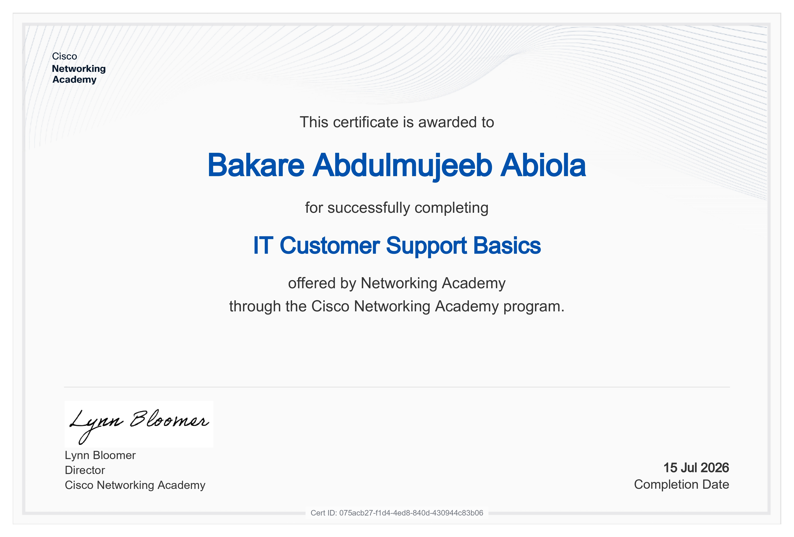
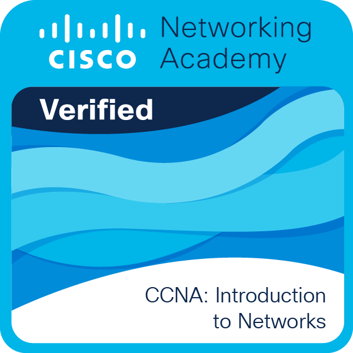

  <h1>Hi, I'm Abdulmujeeb Abiola Bakare 👋</h1>
  <h3>Computer Engineering Student | Software Developer</h3>
  
Federal University of Technology, Akure • <a href="mailto:bakareabdulmujeeb1@gmail.com">Email Me</a> • <a href="https://linkedin.com/in/abdulmujeeb-bakare">LinkedIn</a>

  

    
    
    
    
    
  

---

## 🎯 About Me
I am a Computer Engineering undergraduate at the Federal University of Technology, Akure (FUTA) with a deep-rooted curiosity and a passion for building. Having worked as a teacher alongside my studies, I firmly believe that with the right approach, anyone can learn anything—a philosophy I apply to my own continuous upskilling. 

My journey in tech began with an exploration of graphic design (Figma, Canva) and web design (WordPress, Framer). However, the moment I dove into software development, I knew I had found my true calling. I have since been independently mastering HTML, CSS, and JavaScript, and I am currently building dynamic interfaces with React. I don't just want to know how code works; my goal is to achieve exceptional mastery in software engineering.

I am a constant builder who thrives in collaborative, hands-on environments. Whether it's to engineer a hardware century counter, an embedded digital clock, or a C++ trivia game, I naturally step up to navigate roadblocks and find solutions. After exploring various facets of technology, I have fully dedicated my career path to software development, and I am eager to leave my own footprint in the technology landscape

## 🚀 Featured Projects

* **[Bankist](https://github.com/strangerlab7/bankist)**
  This is a cool banking app built with javascript. It has just four users set in stone and you can transfer funds from each user to another, you can take a loan based on some certain conditions on your account too!
  
* **[Projectify](https://github.com/strangerlab7/Projectify)**
  Projectify is a modern, responsive React project management application designed to help users create projects, manage project-specific tasks, and organize workflows efficiently.
  This project was built from scratch to practice and solidify core React and JavaScript (ES6+) concepts, including state management, props drilling, conditional component rendering, and native browser DOM APIs.
  
* **[Time-freeze](https://github.com/strangerlab7/time-freeze)**
 Time Freeze is a fast-paced, precision-based web game built with React. The concept is simple but highly addictive: choose a time challenge, start the clock, and try to stop it exactly when the timer hits zero. A millisecond too early or a split-second too late, and you lose!
 This project was built to master advanced React concepts, specifically focusing on component synchronization, state batching, intervals, and imperative DOM manipulation using Refs.

* **[Mouse-race](https://github.com/strangerlab7/mouse-race)**
 I built a mouse-race game to imitate the famous pig-game. Users roll a dice and can choose to hold and pass the die or continue rolling to accumulate but if they roll a 1, they lose all their accumulated points and the die is passed automatically!

## 💼 Professional Experience & Leadership

* **President | NACES, FUTA Chapter** *(Nov 2025 - August 2026)*
  Overseeing the executive council, managing activity budgets, and coordinating technical workshops.
* **Engineering Intern | Project Imole Engineering Ltd** *(Sep 2025 - Oct 2025)*
  Collected and analyzed performance data for solar power installations to ensure system efficiency.
* **IT Support Trainee | FUTA CBT Center** *(May 2025 - Sep 2025)*
  Monitored high-traffic network infrastructure during CBT examinations, providing rapid troubleshooting to ensure 99.9% uptime.

---

## 🏆 Certifications & Awards

* **Hackathons & Competitions:** UNESCO Youth Hackathon 2025 Participant. WEMA Bank Hackaholics 6.0
* **Networking & IT:** Cisco IT Customer Support Basics, CCNA: Introduction to Networks, Cisco IT Essentials 8.
* **Professional Development:** HP LIFE Certificates in Critical Thinking in the AI Era, Design Thinking, Effective Leadership, and Social Entrepreneurship.

  
  
  
  
  

